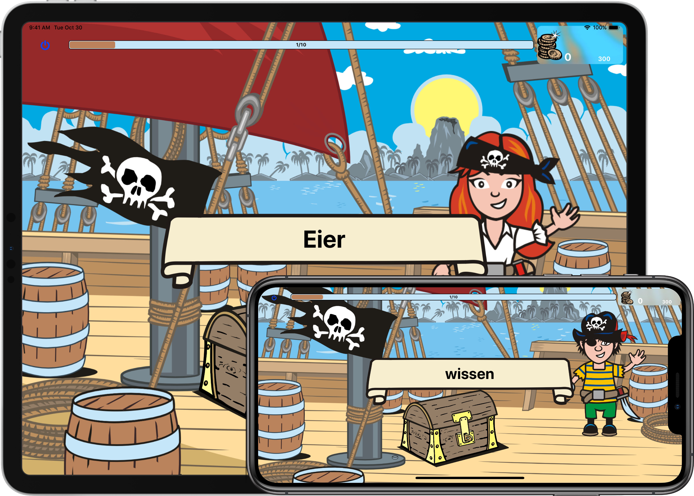

# Lesehelden - Die App

    

    

        Die Lesehelden-App hilft Kindern, die noch in den Leseanfängen 
stecken oder Leseschwierrigkeiten zu bewältigen haben, mit der
 <b>Blitzwortmethode</b> zu einem flüssigeren Lesestil.

  
         
        Kinder mit Leseproblemen neigen zum ungenauen und langsamen
 Lesen sowie zum Lesen von Langvokalen: z.B. <i>„Die Muhteer geht
miet ihreem Kiend zuhm Schwiemmeen."</i>.
        

Mit der Blitzwortmethode wird das blitzschnelle Erkennen ganzer 
Wörter (tachoskopisches Lesen) geübt. Die Methode hilft, Wörter
visuell als ganze Einheit zu erkennen und abzuspeichern.

  
         
        Ziel der Blitzwortmethode ist die Ausdifferenzierung des
 sogenannten Sichtwortschatzes und damit die Entwicklung eines 
flüssigeren Lesestils.

        

            Vom Leseanfänger zum Blitzwortprofi!

        

    

    

